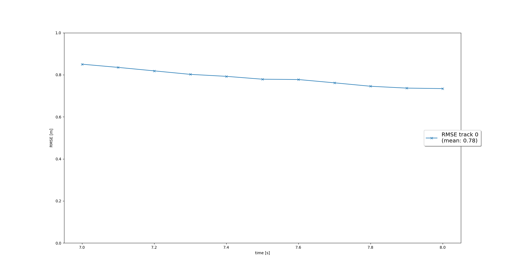

# Tracking
This step is to complete the tracking module for the project. The Matrix & Q have being implemented for 6 states to track object in 3D. The rest of the tracking modules are similar to that of a 2D EKF

 
Matrix F

 
Matrix Q

 
RMSE Plot for step 1

# Track Management

This step is to perform track management needed for multi-object tracking. The following items are implemeneted  
  1) track initialization: creating track for unassigned meas  
  2) track deletion: removal of confirmed track if not longer observed by sensor & removal of non-confrimed track if it not sufficiently stable based on the corvariance matrix 
  3) update track state: to transit between the different state so appropriate processing can take place 
  4) update track score: increase/decrease score depending on wheather track has been updated or not 

 
RMSE Plot for step 2

# Data Association

This step is to perform data association needed for multi-object tracking.  
  1) Generate the association matrix with the mahalanobis distance as the distance metrics
  2) Set highly unlikely association to inf to prevent association
  3) iterate and find min distance and perform assignmennt
  4) Generate unassigned track and meas for subseqent processing
    
 
Screen capture for step 3
 
RMSE Plot for step 3

# Sensor Fusion
This step is to include camera measurement in the fusion system. 
  1) The step are similar in step 3 except that the measurement model & measurement initialization
  2) To implemenet the measurement model, 
     * track state in vehicle frame is transform to sensor frame using the pre-computed transformation matrix
     * track state in sensor frame is then transform to image coordination using camera calibration params
  3) For measurement initialization, Z is initialized as a 2d vector using the detection centre and R is initialized 2x2 matrix with the diagonal set using value from the params.py

 
RMSE Plot for step 4

# Evaluation and Conclusion

## Which part of the project was most difficult for you to complete, and why?

The most difficult part of the project is to implemenet the camera measurement model. The initial implementation resulted in the rejectiion of all camra measurement. I only found out about the missing transformation of the track object state when i try to visualize the measurement on the image. Hence, we need to be clear of all the transformation (veh, sensor, image frame).

## Do you see any benefits in camera-lidar fusion compared to lidar-only tracking (in theory and in your concrete results)?

Yes. The camera-lidar fusion allow for shorter confirmation time and allow track to stay alive longer .
1) Shorter confirmation time: if both camera and lidar detection the object at the current frame, the score will increase faster in camera-lidar tracking over lidar-only tracking. This can also leading to easier confirmation of track as seem in step 4. There is an extra one confirm track as compared to step 3
2) Allow track to stay alive longer: In the same way as shorter confirmation time, the camera-lidar tracking will be able to better maintain the track score even if either one of the sensor(camera/lidar) fail to detect the object as compare to lidar only tracking. 
   
## Which challenges will a sensor fusion system face in real-life scenarios? Did you see any of these challenges in the project?
Some challenges include changing vehicle dynamic, varying weather condition and excessive amount of track object.

1) Changing vehicle dynamic: Our tracking model is based on constant velocity with acceleration as noise. This working reasonably well for this project as there are no turing vehicle. If there are turn vehicle, our tracking performance may suffer
2) Varying weather condition: The weather condition in term of lighting and visibility are fairly great for tracking in our project
3) Excessive amount of track object: Our project only tracking 3 object while real-life system need to be fast and able to track more than just vehicle but human and other object of interest. 

## Can you think of ways to improve your tracking results in the future?

Tracking result can be improve by using alternate/mutliple tracking model and also with additional sensor(s)