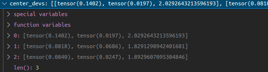

# Compute Lidar Point-Cloud from Range Image

## Visualize range image channels (ID_S1_EX1)

## Visualize point-cloud (ID_S1_EX2)

When other vehicle are very close to the ego vehicle, the vehicle roof appear to more stable.
        

When stationary vehicles are sufficently far away from the ego vehicle, the side, the corner and the bumper of the small vehicle appear to be stable.   
 
For large and long stationary  vehicle, the bumper appear to be more stable as the lidar scan may not be able to see the full vehicle length     
 
 
 
The bumper of incoming and outgoing vehicle is the most stable feature, especially when its very far away

 
 
 
Notice the bumper of the outgoing vehicle remained stable as the it made the right turn

# Create Birds-Eye View from Lidar PCL
## Convert sensor coordinates to bev-map coordinates (ID_S2_EX1)
 

## Compute intensity layer of bev-map (ID_S2_EX2)
 

## Compute height layer of bev-map (ID_S2_EX3)
 

# Model-based Object Detection in BEV Image
## Add a second model from a GitHub repo (ID_S3_EX1)
 

## Extract 3D bounding boxes from model response (ID_S3_EX2)
 

# Performance Evaluation for Object Detection
## Compute intersection-over-union (IOU) between labels and detections (ID_S4_EX1)
 
 

## Compute false-negatives and false-positives (ID_S4_EX2)
 

## Compute precision and recall (ID_S4_EX3)

precision = 0.9506578947368421, recall = 0.9444444444444444 [configs_det.use_labels_as_objects set to FALSE]
  
precision = 1.0, recall = 1.0 [configs_det.use_labels_as_objects set to TRUE]
